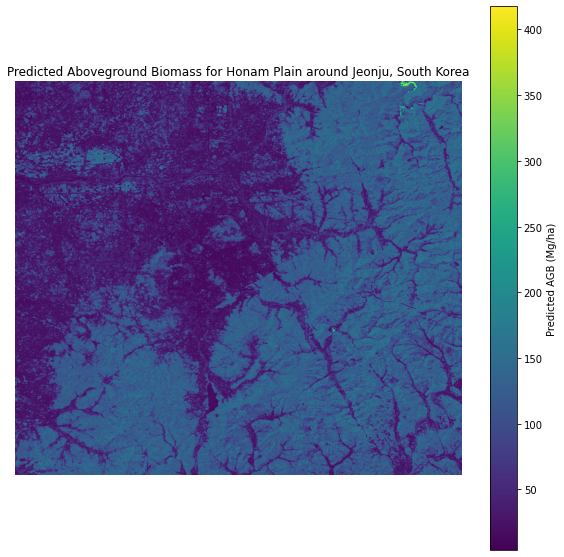

# README for estimating aboveground biomass in Honam Plain around Jeonju (one of South Korea’s largest rice-growing regions)
## Uses RandomForestRegressor trained on GEDI Aboveground Biomass data and Landsat 8 reflectance bands

### Summary of code:

1. Authenticates and initializes Google Earth Engine

2. Defines and clips to South Korea’s boundary

3. Pulls GEDI aboveground biomass (GEDI04_B) points

4. Samples Landsat 8 reflectance bands over those GEDI points

5. Trains a Random Forest regressor linking Landsat bands to GEDI biomass (over all of South Korea)

6. Exports a median Landsat composite of a rice-heavy area in Korea, runs predictions over the area, and writes out a biomass map

